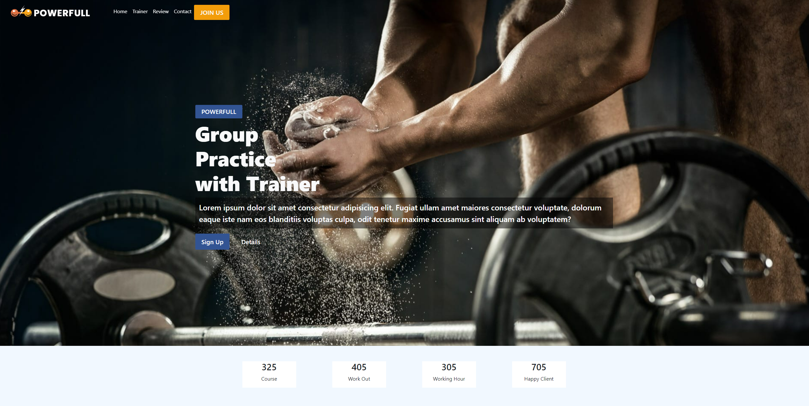
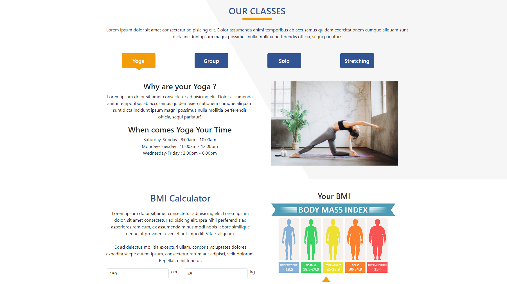

# SportCenter

SportCenter, spor merkezi yönetimi için basit bir web uygulamasıdır. Patika+ Fullstack Web Developer programı kapmasında hazırlanmıştır.

### Kullanılan teknolojiler

- Node.js
- Vite.js
- Bootsrap

### Özellikler

- Spor Salonunda bulunan dersler hakkında bilgilendirme sayfası
- BMI Calculator ile VKE ölçümü yapılması
- Eğiticiler hakkında bilgilendirme
- Satışa sunulan ürünler görüntülenebiliyor
- Müşteri yorumların bulunduğu alan 
- Sport merkezi ile iletişime geçilebileceği iletişim sayfası

### Görünüm

#### Genel bilgilendirme

#### Dersler ve VKE ölçüm alanı

#### Eğitmenler

#### Alışveriş alanı ve müşteri yorumları

#### İletişim

